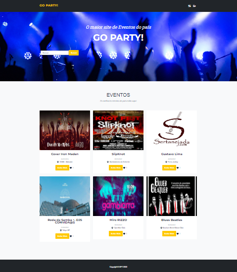
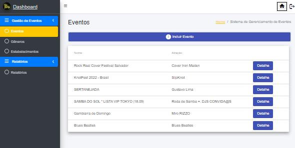

# Desafio Extensão MEAN Stack GFT Start #4

## 📋  Sobre

Projeto com o desafio de extensão MEAN Stack durante o programa Start #4

----------

## 🚀  Tecnologias utilizadas

O projeto foi desenvolvido utilizando as seguintes tecnologias:


 1. [TypeScript](https://www.typescriptlang.org/)
 2. [NodeJs](https://nodejs.org/en/)
 3. [Angular](https://angular.io)
 4. [NestJs](https://nestjs.com/)
 5. [Prisma ORM](https://www.prisma.io/)
 6. [MySQL](https://www.mysql.com/)
 7. [Swagger](https://swagger.io/)


----------

## 📁 Informações gerais

Para executar o projeto primeiro precisa instalar as dependências necessárias da [API](https://git.gft.com/jofh/desafio-extensao/-/tree/backend-develop) de eventos e da aplicação Angular [GoParty](https://git.gft.com/jofh/desafio-extensao/-/tree/front_angular_priscilla_neves).

## 📌 Para executar a API:
1 - Instalar dependências
```bash
$ npm install
```
2 - Executar as migrações 
```bash
$ npx prisma migrate dev
```
3 - Executar o projeto
```bash
# development
$ npm run start

# watch mode
$ npm run start:dev
```
#### Credenciais para acesso de ADMIN:
email: admin@gft.com
password: Gft@1234

#### Credenciais para acesso de USUÁRIO:
email: usuario@gft.com
password: Gft@1234

## 📌 Para executar a aplicação Angular:


[Angular CLI](https://github.com/angular/angular-cli) versão 14.1.3.

Para executar o projeto:

Execute `ng serve` para um servidor dev. Navegue até `http://localhost:4200/`. O aplicativo será recarregado automaticamente se você alterar qualquer um dos arquivos de origem.

## Sobre o sistema:

* O perfil ADMIN tem a maior parte de acesso aos CRUD da API podendo cadastrar, deletar, consultar e atualizar, já o perfil USUARIO que seria de acesso dos clientes, apenas algumas consultas e cadastro de novo usuário. Os clientes podem fazer as consultas de gênero, estabelecimentos, eventos, além de poder adicionar curtidas em cada evento.

* Também é possível fazer a consulta de todos os eventos curtidos por cada usuário, consultas de eventos por nome e por gênero.

* O site tem duas vertentes :a Home e o Dashboard: 

* Home: aberta ao público, é possivel filtrar por evento e ter acesso ao "saiba mais" com mais detalhes do evento e link para compra de ingressos.
Para curtir o evento é necessário estar logado.
<p align="center">
  
</p>

* Dashboard:para Usuario e Admin
Crud completo de eventos, generos e estabelecimentos, com todas as funcionaldades. É possível ainda gerar um relatório e exportar em excel assim como imprimir os eventos.
<p align="center">
  
</p>


#### Meta

>Autor: Priscilla Neves de Souza Santos – priscilla.santos@gft.com

>Autor: José Orlando Ferreira do Nascimento Filho – jose-orlando.filho@gft.com
